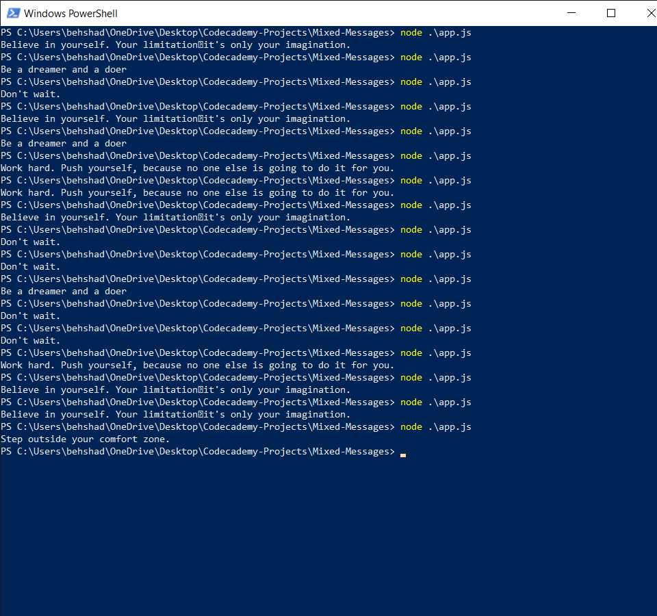

# Mixed Messages
> The projects outputs various random messages to the user each time the program is run
> <!--Live demo [_here_]().  If you have the project hosted somewhere, include the link here. -->

## Table of Contents
* [General Info](#general-information)
* [Technologies Used](#technologies-used)
* [Screenshots](#screenshots)
* [Setup](#setup)
* [Usage](#usage)
* [Project Status](#project-status)
* [Room for Improvement](#room-for-improvement)
* [Acknowledgements](#acknowledgements)
* [Contact](#contact)
<!-- * [License](#license) -->

## General Information
This program is written to showcase basic knowldege of developing and running apps in node.js. The program outputs a random message from a variety of 5 messages
each time the program is run.
<!-- You don't have to answer all the questions - just the ones relevant to your project. -->

## Technologies Used
-  Node.js - version 16.6.1
- git - version 2.32.0.windows.2
- github

## Screenshots

<!-- If you have screenshots you'd like to share, include them here. -->

## Setup
You can run this program on your local machine if you have node.js configured properly on your local device

## Usage
Program is run and each time a random message is shown

## Project Status
Project is: in progress

## Room for Improvement
- Grabing basic info such as name from user and displaying it along with the random message

## Acknowledgements
- Many thanks to codecademy for including idea for this project on their full-stack development path 

## Contact
Created by Behshad Babai - feel free to contact me via email!
my email: behshad.babai@gmail.com

<!-- Optional -->
<!-- ## License -->
<!-- This project is open source and available under the [... License](). -->

<!-- You don't have to include all sections - just the one's relevant to your project -->
